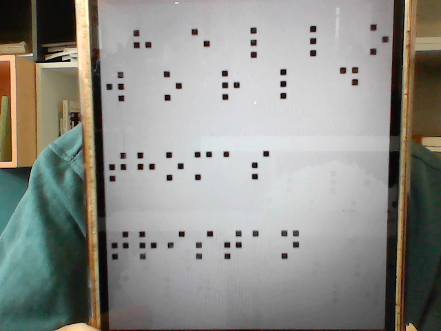

# BrailleTranslateV3

## Sommaire

- [Objectif](#objectif--renforcer-lalgorithme-déjà-établie)
- [Prérequis](#prérequis)
- [Utilisation](#utilisation)
- [Fonctionnement](#fonctionnement-braillereaderv3)
- [Perspective](#perspectives)

## Objectif : Renforcer l'algorithme déjà établie

- Pouvoir traduire une image avec un fond quelconque telle que celle-ci :

    Entrée :  
    

    Sortie :  
    

## Prérequis

Verifier que vous soyez bien dans le dossier [BrailleTranslateV3](.)

```bash
pwd
>> ...\BrailleTranslateV3
```

Installer les bibliothèques nécessaires (numpy et openCV) :

```bash
pip install -r .\requirements.txt
```

## Utilisation

### Traduire sur une image

Utilisez la commande suivante suivit du chemin d'accès de l'image sur laquelle se trouve le texte en braille à traduire

```bash
python .\imageTranslate.py <chemin/image.extension>
```

Si votre texte n'est pas, ou est mal traduit, utilisez les touches `'t'` et `'y'` pour ajuster la **valeur de seuillage**.

Enfin, la touche `'q'` permet de quitter le programme.

Utiliser l'option `-a` permet d'ajuster automatiquement la valeur de seuillage (cette fonctionnalité est encore cours de [développement](#seuillage-automatique) et n'est pas toujours très efficace).

```bash
python .\imageTranslate.py <chemin/image.extension> -a
```

Rajouter l'option `-d` permet d'avoir plus d'information et de mieux visualiser comment fonctionne le programme.

```bash
python .\imageTranslate.py <chemin/image.extension> -d
# Les options peuvent etre cumulees
python .\imageTranslate.py <chemin/image.extension> -da
```

Pour plus de détails sur le programme et ses options :

```bash
python .\imageTranslate.py -h
```

Si vous ne disposer pas d'image, vous pouvez :

- Utiliser les images de test présents dans le  dossier [`res`](./res/)

    Par exemple :

    ```bash
    python .\imageTranslate.py .\res\pres3.png
    ```

- Créer vos propres images :

    1. Ecrire le text en braille à l'aide de notre "éditeur de braille"

        ```bash
        python .\brailleWriter.py
        ```

        [Rappel d'utilisation](../BrailleTranslate2022/README.md/#1-ecrire-du-texte-en-braille)

    2. Prendre ce texte en photo à l'aide d'un téléphone
    3. Transférer cette photo sur l'odinateur ou utiliser la webcam pour prendre en photo le braille sur le téléphone

        ```bash
        python .\videoCapture.py
        ```

        Utiliser la touche `'s'` pour prendre la photo, elle sera enregistrée sous le nom de *"videoImage.png"* dans le dossier [`res`](./res/).

        Utiliser la touche `'q'` pour quitter le programme.

        

### Traduire sur les images de votre webcam

Utilisez la commande suivante pour traduire du braille en direct :

```bash
python .\liveTranslate.py
```

Les mêmes options que pour la [traduction sur image](#traduire-sur-une-image) sont disponibles pour ce programme, pour plus de détails :

```bash
python .\liveTranslate.py -h
```

## Fonctionnement brailleReaderV3

### 1. Conversion en noir et blanc puis seuillage de l'image

Comme pour la version précédente [`brailleReaderV2`](BrailleTranslate2022/brailleReaderV2.py), la première étape consiste a convertir l'image en niveau de gris puis d'appliquer un **seuillage** pour n'avoir plus que des pixels noirs ou blancs.

Résultat pour une valeur de seuillage égale à 75 :


### 2. Filtrage des points

Ici nous ne pouvons plus procéder comme dans la version précédante : il faut différencier les éléments qui nous intéressent des éléments du décor.

Pour mieux voir ce qu'il se passe, utilisons la fonction *findContour()* et dessinons un rectangle autour des éléments trouvés :


Nous pouvons remarquer que les points qui nous intérressent ont tous étés détectés (ce qui n'est pas toujours le cas), mais que beaucoup d'autres éléments sont aussi présents.

Pour garder les points qui nous intéressent, nous allons appliquer plusieurs filtres.

**2.1 Filtre 1 :**

- 2.1.1 Assez grand :

    Un point doit avoir une largeur et une longueur supérieur à **7 pixels**
- 2.1.2 Pas trop grand :

    Un point doit avoir une **largeur inférieur à 1/3 de la largeur de l'image**, et une **longueur inférieur à 1/5 de la largeur de l'image**.
- 2.1.3 "Un peu près" carré :

    Un point doit avoir une **largeur égale à plus ou moins 25% de sa longueur**

Résultat après filtre 1 :


Ce filtre nous à permis de retirer la quasi-totalité des éléments qui ne nous intéressent pas, tout en conservant ceux qui nous intérressent !

Il reste encore un élément non désiré (au milieu à droite) à retirer.

**2.2 Filtre 2 :**

Se fondre dans la masse :

Un point doit avoir une aire un peu près égale à celle des autres points.

- Nous calculons l'aire moyenne avec les points ayant passé le premier filtre

- Les points sont retirés un à un, en commençant par celui ayant l'aire la plus éloigné de l'aire moyenne, jusqu'à ce que la ***variance*** soit assez faible

Résultat après filtre 2 :


Les points n'ayant pas passé le deuxième filtre apparaissent avec un cercle en plus.

### 3. Touver et grouper les points d'un même caractère

Même procédé que pour [`brailleReaderV2`](../BrailleTranslate2022/README.md/#222-touver-et-grouper-le)


### 4. Déterminer la zone de chaque caractère

Dans cette version, nous n'allons pas appliquer les dimensions du plus grand caractère à tous les autres, mais nous allons essayer d'**ajuster** les dimensions pour chaque caratère.


Pour ce faire, nous n'allons pas toucher aux caractère ayant déjà les bonnes dimensions (mis en évidence par un rectangle plus épais) et nous allons appliquer la **moyenne de leur dimension** pour les autres caractère encore incomplet.


Il ne reste plus qu'a regrouper les caractères qui se superposent, de la même manière que dans la version précédente.


Les caractères sont enfin prêts à être traduit

Résultat :


## Perspectives

### 1.Seuillage automatique

Jusqu'à présent il fallait ajuster la valeur de seuillage manuellement, l'idée serait d'automatiser ce procédé.

Une version de test est en cours de développement, pour le tester, ajouter l'option `-a` ou `--auto`.

Le programme va chercher la valeur de seuillage en suivant le principe suivant :

Sachant que la valeur de seuillage est comprise entre **0 et 255**, on commence par seuiller l'image avec **trois** valeurs équiréparties (63, 126, 189) sur la plage pécédente (0, 255) : on utilise la recherche par **trichotomie**

Pour chacune des valeurs de seuillage nous obtenons un resultat différents, il faut déterminer un ``critère de parformance`` pour déterminer quelle est le mailleur seuille parmis les trois.

Une fois la meilleur valeur de seuillage trouvée, on réduit la plage autour de cette valeur, et on réitère l'opération jusqu'à ce que les trois valeurs donnent les mêmes resultats, ou jusqu'à ce que ces les résultats n'évoluent plus.

#### 1.1. Critère de performance

Le critère de performance utilisé dans cette version est le nombre de points détectés sur l'image. Ce critère n'est pas le plus pertinent mais permet d'avoir une première approche pour le seuillage automatique.

### 2. Détecter les mots, les nombres

L'un des prochains objectifs est de pourvoir détecter et traduire **les nombres**.


Pour écrire un chiffre en braille, on réutilise les dix premières lettres de l'alphabet précédées d'un caractère spécial qui sert de préfix.

Tous les caractères qui suivent ce préfix seront traduits comme des chiffres.

Il est donc nécessaire dans un premier temps de détecter les mots pour connaître les délimitations.