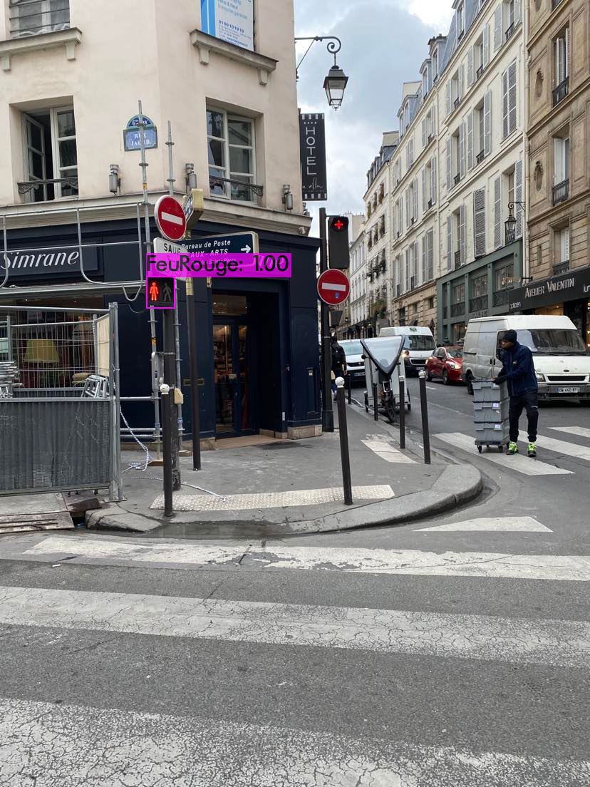

# Détecteur de feu piéton

## Sommaire

- [Objectif](#objectif--créer-un-algorithme-de-détection-de-feu-piéton)
- [Procédé](#procédé)

## Objectif : Créer un algorithme de détection de feu piéton

Entraîner un algorithme de détection de feu piéton par apprentissage supervisé (YOLOv4)

Ce detecteur pourra être implémenter sur une application mobile pour aider les déficients visuels à traverser les passages piétons en sécurité : la couleur du feu sera détecté puis un signal sonore indiquera l'état du feu à l'utilisateur.

Il suffira de convertir le poids au format **YOLOv4** au format **tfLite**

## Procédé

Toute cette partie à été réalisé en suivant le tutoriel suivant : [TRAIN A CUSTOM YOLOv4 OBJECT DETECTOR](https://medium.com/analytics-vidhya/train-a-custom-yolov4-object-detector-using-google-colab-61a659d4868)



### Etapes clés

#### 1. Création de la base de données

Notre algorithme à été entraîné sur une base de données composée de **362 photos** de feu piéton que nous avons pris dans Paris.

Ces photos ont été prises avec nos téléphones et ont une résolution de **12Mpx** (3024x4032), ce qui représente une très bonne qualité d'image pour ce que nous voulons faire.

#### 2. Labélisation des images

Une fois que nous avons nos images, il faut les labéliser.

Ce travail consiste à encadrer, sur nos images, les objets que notre IA devra reconnaître, et indiquer leur classe. Dans notre cas, nous avons trois classes :

- Feu Rouge

- Feu Vert

- Inconnu


Pour cela nous avons utilisé l'outil ["labelImg"](https://github.com/heartexlabs/labelImg).

#### 3. Entraînement de l'IA

Avant de lancer l'entraînement nous devons modifier le fichier de [configuration](./res/yolov4-custom.cfg).

Nous avons entraîné l'IA une première fois avec les valeurs suivantes pour les tailles de redimensionnement :

```txt
width=416
height=416
```

Cependant après une dizaine d'heure d'entraînement, l'IA avait des performences très insatisfaisante.

Cela est dû au fait que dans notre cas, les objets que nous voulons détecter sont très petits par rapport à la taille de nos images. Donc si on passe d'une image de taille 3024x4032 à 416x416, nos feux seront indistinguable.

Nous avons donc recommencé avec les valeurs suivantes :

```txt
width=832
height=832
```

Le mieux serait de prendre les plus grandes dimensions possibles, tout en restant inférieur aux dimensions des images, mais plus l'image est grande, plus il faut de puissance de calcul.

## Résultat

Après une vingtaine d'heure d'entraînement nous obtenons un fichier **.weights** qui est le "coeur" de l'IA.

Ce fichier ainsi qu'une video de démonstration est disponible sur notre drive partagé.
