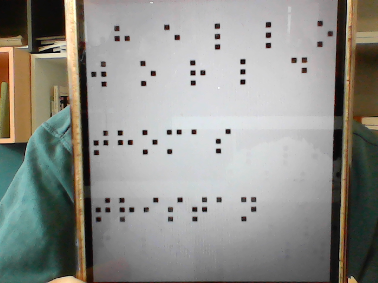
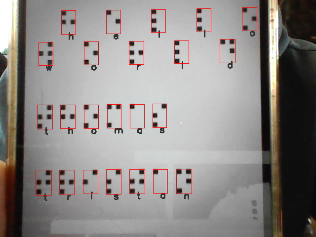
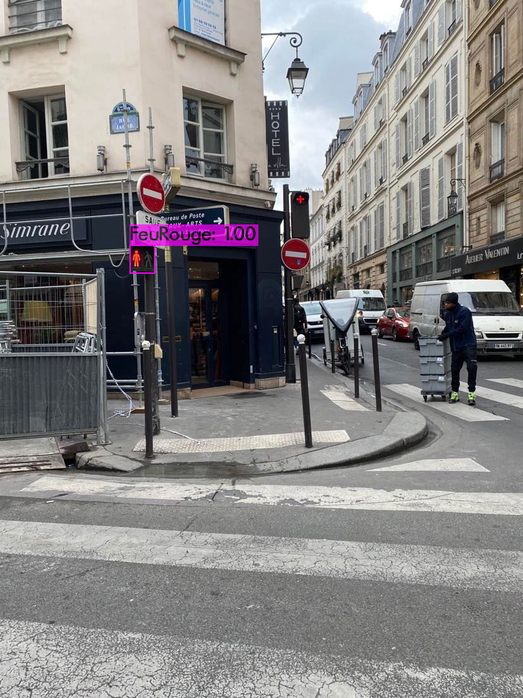
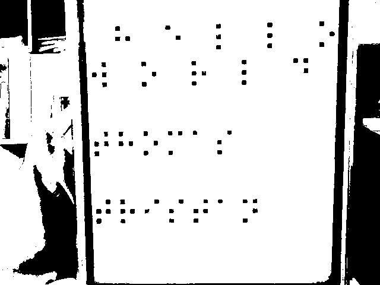
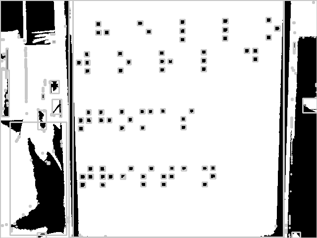
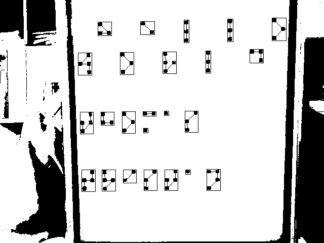
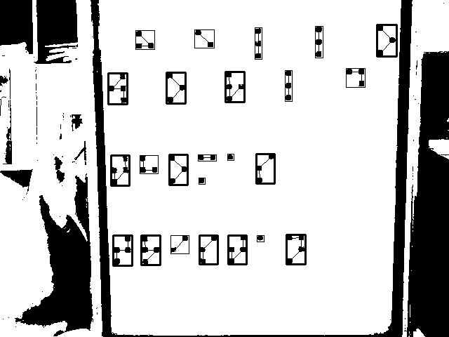
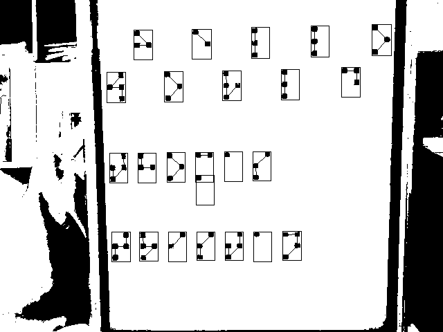

# BrailleTranslate 2023

Traducteur de braille français - Projet de la mineur ***Métiers de la création 2***

Ce projet est la continuation du projet [`BrailleTranslate2022`](./BrailleTranslate2022/)

## Objectifs

### 1. brailleReaderV3 - Renforcer l'algorithme déjà établie

- Pouvoir traduire une image avec un fond quelconque telle que celle-ci :

    Entrée :  
    

    Sortie :  
    

### 2. Créer un détecteur de feu piéton

- Deep Learning (YOLOv4)

### 3. Porter le code sur une application mobile

- Flutter

## Fonctionnement brailleReaderV3

### 1. Conversion en noir et blanc puis seuillage de l'image

Comme pour la version précédente [`brailleReaderV2`](BrailleTranslate2022/brailleReaderV2.py), la première étape consiste a convertir l'image en niveau de gris puis d'appliquer un **seuillage** pour n'avoir plus que des pixels noirs ou blancs.

Résultat pour une valeur de seuillage égale à 75 :

### 2. Filtrage des points

Ici nous ne pouvons plus procéder comme dans la version précédante : il faut différencier les éléments qui nous intéressent des éléments du décor.

Pour mieux voir ce qu'il se passe, utilisons la fonction *findContour()* et dessinons un rectangle autour des éléments trouvés :

Nous pouvons remarquer que les points qui nous intérressent ont tous étés détectés (ce qui n'est pas toujours le cas), mais que beaucoup d'autres éléments sont aussi présents.

Pour garder les points qui nous intéressent, nous allons appliquer plusieurs filtres.

**2.1 Filtre 1 :**

- 2.1.1 Assez grand :

    Un point doit avoir une largeur et une longueur supérieur à **7 pixels**
- 2.1.2 Pas trop grand :

    Un point doit avoir une **largeur inférieur à 1/3 de la largeur de l'image**, et une **longueur inférieur à 1/5 de la largeur de l'image**.
- 2.1.3 "Un peu près" carré :

    Un point doit avoir une **largeur égale à plus ou moins 25% de sa longueur**

Résultat après filtre 1 :

Ce filtre nous à permis de retirer la quasi-totalité des éléments qui ne nous intéressent pas, tout en conservant ceux qui nous intérressent !

Il reste encore un élément non désiré (au milieu à droite) à retirer.

**2.2 Filtre 2 :**

Se fondre dans la masse :

Un point doit avoir une aire un peu près égale à celle des autres points.

- Nous calculons l'aire moyenne avec les points ayant passé le premier filtre

- Les points sont retirés un à un, en commençant par celui ayant l'aire la plus éloigné de l'aire moyenne, jusqu'à ce que la ***variance*** soit assez faible

Résultat après filtre 2 :

Les points n'ayant pas passé le deuxième filtre apparaissent avec un cercle en plus.

### 3. Touver et grouper les points d'un même caractère

Même procédé que pour [`brailleReaderV2`](BrailleTranslate2022/brailleReaderV2.py)

### 4. Déterminer la zone de chaque caractère

Dans cette version, nous n'allons pas appliquer les dimensions du plus grand caractère à tous les autres, mais nous allons essayer d'**ajuster** les dimensions pour chaque caratère.

Pour ce faire, nous n'allons pas toucher aux caractère ayant déjà les bonnes dimensions (mis en évidence par un rectangle plus épais) et nous allons appliquer la **moyenne de leur dimension** pour les autres caractère encore incomplet.

Il ne reste plus qu'a regrouper les caractères qui se superposent, de la même manière que dans la version précédente.

Les caractères sont enfin prêts à être traduit

Résultat :

## Contributeurs

- Du Thomas
- Jules Tristan
