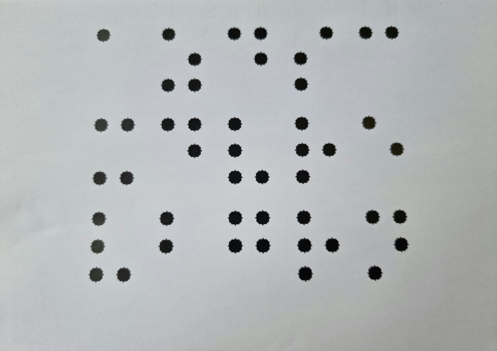
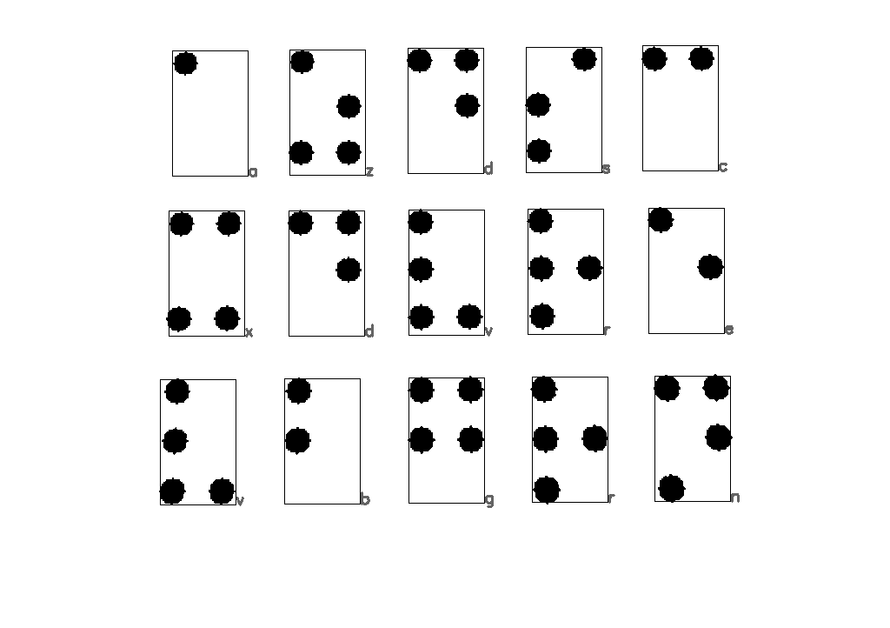

# BrailleTranslate 2022

Traducteur de braille français - Projet de la mineur ***Métiers de la création 1***

## Application

Application permettant d'avoir une première approche avec le braille

Prérequis :

Installer *tkinter*

Linux OS

```bash
python3 ./app.py
```

Windows OS

```bash
python ./app.py
```

### Aperçu


Application basée sur la table suivante :

[](https://fr.wikipedia.org/wiki/Braille)

## Traducteur de braille

Pour traduire un texte en braille, il faut déjà avoir le texte.

### 1. Ecrire du texte en braille

Prérequis :

Installer *cv2 (cv)*

Linux OS

```bash
python3 ./brailleWritter.py
```

Windows OS

```bash
python ./brailleWritter.py
```

Ce script permet de d'écrire un texte en braille sur une image blanche.

Utiliser la touche :

- "entrée" pour sauter une ligne
- "échap" pour enregistrer l'image et quiter

Une image intitulée "brailleText.png" sera ensuite enregistrée dans le dossier [`./res/`](res)


Il est possible de modifier :

- La taille des points
- La formedes points (rond ou carré)
- Les dimensions de l'image
- Le point de départ d'écriture

### 2. Lire et traduire ce texte

Prérequis :

Installer *cv2 (cv)*

#### 2.1. brailleReaderV1

Linux OS

```bash
python3 ./brailleReader.py
```

Windows OS

```bash
python ./brailleReader.py
```

Ce [`script`](./brailleReader.py)
 va ensuite récupérer l'image enregistrée précédemment pour traduire le braille qu'elle contient.

Voici le résultat :


#### 2.2. brailleReaderV2

Cette deuxième version va permettre de gérer les photos de texte braille comme celle-ci :



- 2.2.1. Conversion en noir et blanc puis seuillage de l'image

La première étape consiste a convertir l'image en niveau de gris puis d'appliquer un **seuillage** pour n'avoir plus que des pixel noirs ou blancs.

Il est aussi possible d'utiliser des fonctions d'**érosion** et de **dilatation** afin de supprimer d'éventuels *bruit* dans l'image.

- 2.2.2. Grouper les points d'un même caractère

Voici le résultat :



## Contributeurs

- Du Thomas
- Jules Tristan
