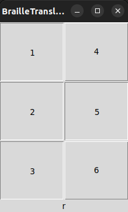

# BrailleTranslate 2022

Traducteur de braille français - Projet de la mineur ***Métiers de la création 1***

## Application

```bash
python3 ./app.py
```

Aperçu :



Application basée sur la table suivante :

[](https://fr.wikipedia.org/wiki/Braille)

## Traducteur de braille

Pour traduire un texte en braille, il faut déjà avoir le texte.

### 1. Ecrire du texte en braille

```bash
python3 ./brailleWritter.py
```

Ce script permet de d'écrire un texte en braille sur une image blanche.

Utiliser la touche :

- "entrée" pour sauter une ligne
- "échap" pour enregistrer l'image et quiter

Une image intitulée "brailleText.png" sera ensuite enregistrée dans le dossier [`./res/`](res)


### 2. Lire et traduire ce texte

```bash
python3 ./brailleReader.py
```

Ce script va ensuite récupérer l'image enregistrée précédemment pour traduire le braille qu'elle contient.

Voici le résultat :


## Contributeurs

- Du Thomas
- Jules Tristan
