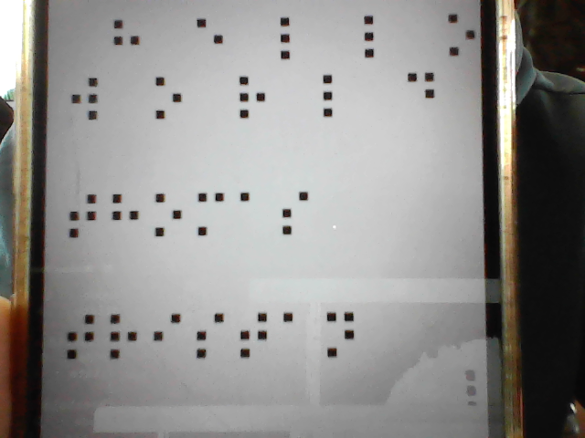
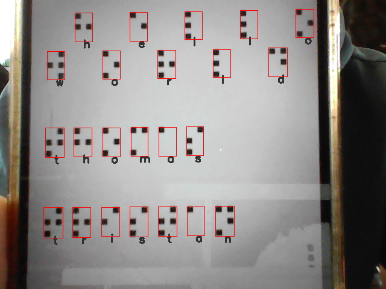

# BrailleTranslate 2023

Traducteur de braille français - Projet de la mineur ***Métiers de la création 2***

Ce projet est la continuation du projet [`BrailleTranslate2022`](./BrailleTranslate2022/)

## Objectifs

### 1. brailleReaderV3 - Renforcer l'algorithme déjà établie

- Pouvoir traduire une image avec un fond quelconque telle que celle-ci :

    Entrée :  
    

    Sortie :  
    

### 2. Créer un détecteur de feu piéton

- Deep Learning (YOLOv4)

### 3. Porter le code sur une application mobile

- Flutter

## Fonctionnement brailleReaderV3

1. Conversion en noir et blanc puis seuillage de l'image

    Comme pour la version précédente [`brailleReaderV2`](BrailleTranslate2022/brailleReaderV2.py), la première étape consiste a convertir l'image en niveau de gris puis d'appliquer un **seuillage** pour n'avoir plus que des pixels noirs ou blancs.

    Résultat pour une valeur de seuillage égale à 75 :

    

2. Filtrage des points

    Ici nous ne pouvons plus procéder comme dans la version précédante : il faut différencier les éléments qui nous intéressent des éléments du décor.

    Pour mieux voir ce qu'il se passe, utilisons la fonction *findContour()* et dessinons un rectangle autours des éléments trouvés :

    

    Nous pouvons remarquer que les points qui nous intérressent ont étés détectés (ce qui n'est pas toujours le cas), mais que beaucoup d'autres éléments sont aussi présents.

    Pour garder les points qui nous intéressent, nous appliquer plusieurs filtres.

    2.1 Filtre 1:

    - Assez grand :

        Un point doit avoir une largeur et une longueur supérieur à **7 pixels**
    - Pas trop grand :

        Un point doit avoir une **largeur inférieur à 1/3 de la largeur de l'image**, et une **longueur inférieur à 1/5 de la largeur de l'image**.
    - "Un peu près" carré :

        Un point doit avoir une **largeur égale à plus ou moins 25% de sa longueur**

    Résultat après filtre 1 :

    

## Contributeurs

- Du Thomas
- Jules Tristan
